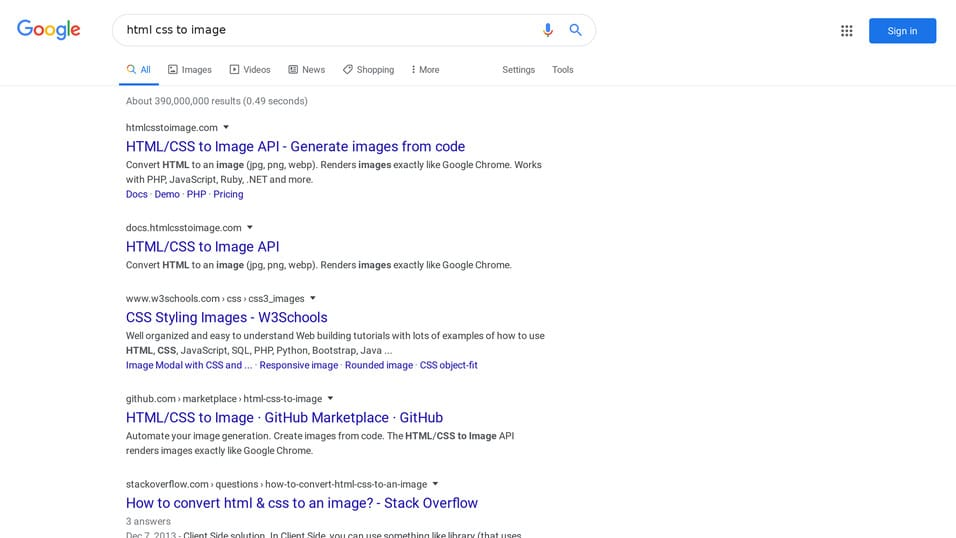
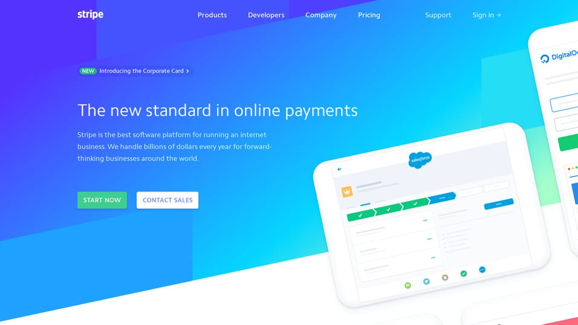

# URL to image

With the API, you can automate taking a screenshot of any website. It's incredibly simple.

Pass the `url` param to the `hcti.io/v1/image` endpoint, and we'll generate a screenshot for you. Here's an example using cURL.

```text
curl -X POST https://hcti.io/v1/image -u 'UserID:APIKey' 
             -d url="https://google.com"
```


Don't write code? Don't worry, you can also do this with our [Zapier integration](zapier-integration.md).




### Additional parameters

To customize your image further, you can take advantage of the following optional parameters.

| Parameter |  |
| :--- | :--- |
| viewport\_width | Set the width of Chrome's viewport. Defaults to 1366. |
| viewport\_height | Set the height of Chrome's viewport. Defaults to 768. |
| device\_scale | This adjusts the pixel ratio for the device. Default: 1. Maximum 3. |
| ms\_delay | The number of milliseconds the API should delay before taking the screenshot. This is useful when waiting for JavaScript. If you need to use this, we recommend starting with a low number, such as `500`. Increasing this value slows down the speed of your initial render. |
| selector | A CSS selector for an element on the webpage. We'll crop the image to this specific element. For example: `section#complete-toolkit.container-lg` |

### Screenshot examples

A full screenshot of `stripe.com`. With device scale set to 2, for a super high resolution image.



### Screenshot part of a page with Selector

You can set a `selector` to target a specific part of the page. 

For example, on Stripe's homepage, there is an element with the CSS selector `section#complete-toolkit.container-lg`.

When passing that to the API, we crop to that element only.



### CSS Selectors

To learn about CSS Selectors, we recommend [this article](https://www.w3schools.com/cssref/css_selectors.asp). There are also Chrome extensions that detect them for you, we like using: [Selector Gadget](https://chrome.google.com/webstore/detail/selectorgadget/mhjhnkcfbdhnjickkkdbjoemdmbfginb?hl=en).


### Need help getting started?

We'd be happy to walk you through getting started. Send us an email: **support@htmlcsstoimage.com**. We're experts at generating images and will help you get going using the API.

